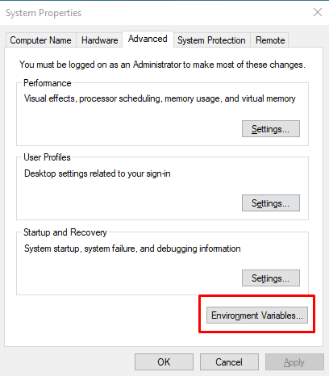

# Scout Database

The purpose of this database is to create a website where administrators, advisors, or leaders of scouts can view existing scouts, awards, and volunteers. It also allows them to add new scouts (including details such as rank, birthday, and parent information), add new volunteers (with volunteer information and the ability to associate them as merit badge counselors or parents of scouts), and track/record attendance for meetings attended or missed by scouts. This website was designed to help users stay on track with their scouts, enabling effective planning based on the various queries available to users.

## Table of Contents
- [Installation](#installation)
- [Usage](#usage)
- [Improvments](#improvements)

## Installation

### 1. **IDE and Extenstions**
    - Visual Studio Code is recommended for the IDE of use in order to open the project and test for yourself (only if the extensions are available to you).
    - Extensions: These are the following extensions needed in order to open the project and also view the table if necessary
        - **[SQLite Viewer - Florian Klampfer](https://marketplace.visualstudio.com/items?itemName=qwtel.sqlite-viewer)**: Used to view the tables within the DatabaseCreator.db file 
        - **[PHP Server - Brapifra](https://marketplace.visualstudio.com/items?itemName=brapifra.phpserver)**: Used to view the php files (more information on this later on)

### 2. **XAMPP Installation & Setup**
    **DISCLAIMER: THIS SETUP AND INSTALLATION IS FOR WINDOWS SYSTEMS**
    - In order to view the servers, you need XAMPP which is a PHP development environment that we used to open and create our database.
        - **[XAMPP - Apache Friends](https://www.apachefriends.org/)**: It should redirect you and automatically download the program onto your computer. 
            - [Installation Guide Video](https://www.youtube.com/watch?v=VCHXCusltqI&ab_channel=GeekyScript): If you prefer a video guide, you can watch this installation guide on YouTube for a step-by-step process.
    - After downloading and setting XAMPP, you must setup the environment variables in order to run the PHP path that is in this project. 
        1. First, find the pathway to your PHP file within the file explorer. To do this, go to your local disk (main storage drive), navigate to the xampp folder, and find the php folder and copy the path that leads to that folder.
        
        2. Search **Edit the System Environment Variables** within your system and a display should appear titled "System Properties". Click on the **environment variables** button on the bottom right corner of the display.
        
        3. Scroll the environment variables display and find the system variable that is named "Path" and press edit once you have clicked on the path. 
        
        4. You will then see a new display with different paths. Click "new" and place the path that you have copied earlier onto the Edit environment variable table and press okay once you have finished.
        
        5. Once that is done, you will need to open the XAMPP Control Panel (downloaded previously from apachefriends.org). Once you have opened, a display will show with different modules along with several start, config, and logs. You will need to locate the **Apache** module and click the "config" button. Once clicked, several panels will appear, however, we will want to choose the one that says **PHP (php.ini)** as this is our confirguration setting for PHP. 
        
        6. Depending on your system, a large notepad will appear wth several lines of writing that we commented out by **;**. We want to press **CTRL + F** and type **"extension=sqlite3**. Press **Find Next** and it will direct us to the specific line of code. Once we have found it, remove the **;** from the line. Save the configuration and exit the notepad.
        
        7. After these steps are completed, you will have access to the website and the features that are offered within the website!
### **INSTALLATION FOR macOS SYSTEMS**
1. Install homebrew, this should only be one command within the terminal, however, for more information you can find on their website **[Homebrew](https://brew.sh/)**.
    - ` /bin/bash -c "$(curl -fsSL https://raw.githubusercontent.com/Homebrew/install/HEAD/install.sh)" `
2. After installing homebrew, open the terminal and enter the following command:
    - `brew install php`
3. Once installed (it might take a few minutes), you will be able to follow the next steps to opening the website in [Usage](#usage)!
    
## USAGE
1. When opening the project, find the **home.php** file and right click on the focused file. Tabs should be displayed, look for **PHP Serve: Serve Project**. This will allow you to open the project and view the website through your local host!

2. You can create an account that will be added to the database, or you can use an existing user account with the username **User** and password **User**. 
3. After logging in, you will have access to all the features such as adding, viewing, editing, and deleting scouts, volunteers and marking attendance and awards as well. A display will appear when successfully removed or added to the database.
4. Use the search input field to instantly find different scouts, awards, or volunteers at real time without any delay. This will also apply to date inputs as well.
5. For any reason, if you are required to reset the database. You can delete the DatabaseCreator.db file and create a new DatabaseCreator.db file. 
    - In order to do this, open your terminal and `cd scoutWebsite`. 
    - After doing that, enter this line of command `cat DatabaseCreator.sql | sqlite3 DatabaseCreator.db`. 
    - Once entered, the new DatabaseCreator.db table should be opened and can be viewed using the extension SQLite Viewer. 
6. If you want to view other pages specifically, follow the same instruction that was told for **home.php**, however, instead of clicking **PHP Server: Serve Project**, choose **PHP Server: Reload Server** which will open the new PHP page.
7. When finished with the server, you can right click and choose **PHP Server: Stop Server** and it will close all instances of the PHP files and will not open until **PHP Server: Serve Project** is opened again.  

## IMPROVEMENTS
- Improvements include:
    - Better data integrity within the database. Making sure duplicate data is recognized and error handled when adding or editing data.
    - Improvments in the UI: Creating a more user-friendly UI with a modern design and possibly more responsive interactions.
